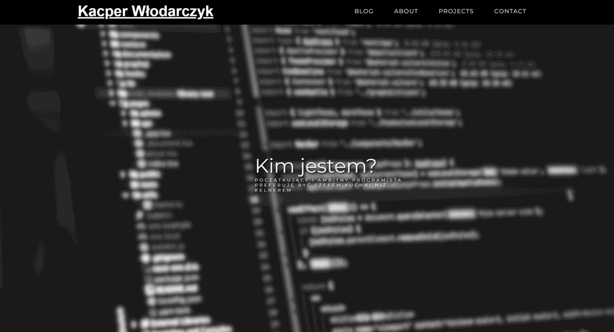
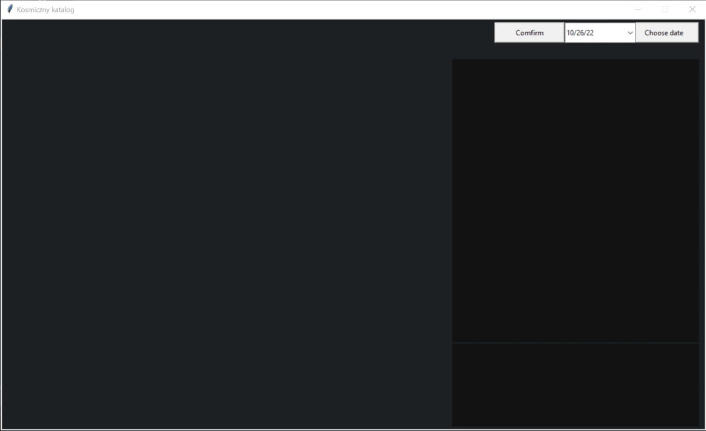

# 💫 About Me:
I'm currently working on my own website and learning Django. When I want to clear my head I'm reading about space.

## 🌐 Socials:
  

# 💻 Tech Stack:
    
# 📊 GitHub Stats:
 
 

---

<!-- Proudly created with GPRM ( https://gprm.itsvg.in ) -->

